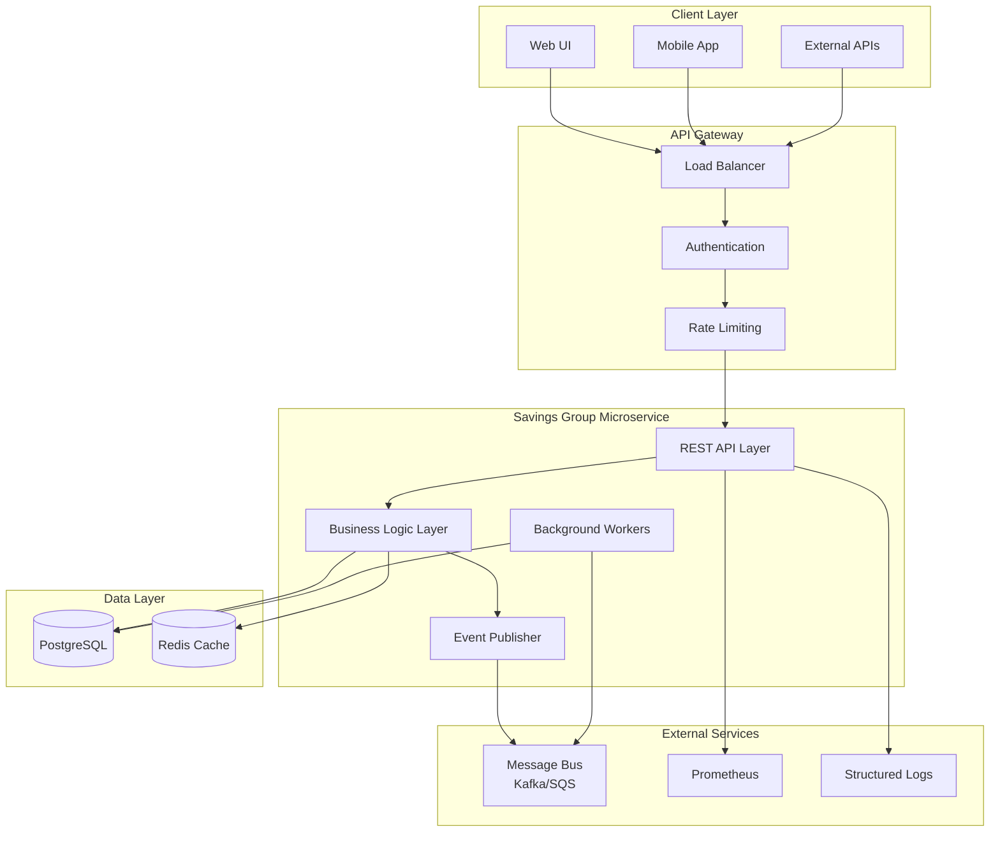

# Design Document

## Overview

The Savings-Group Microservice is designed as a stateless, horizontally scalable service that manages the complete lifecycle of savings groups and group loans following the VisionFund model. The service implements event-driven architecture with REST APIs for synchronous operations and message bus integration for asynchronous cross-service communication.

### Enhanced Features (Version 2.0)

The system has been significantly enhanced with comprehensive financial management capabilities:

- **Enhanced Group Management**: Required location fields, constitution tracking, and registration certificate management
- **Multiple Saving Types**: Personal, ECD Fund, Social Fund, and Target savings with configurable parameters
- **Mobile Money Integration**: Remote savings with transaction verification workflow
- **Meeting Attendance Tracking**: Participation metrics for loan assessment
- **Fines Management**: Multiple fine types with payment tracking
- **Comprehensive Cashbook**: All financial activities with running balances by category
- **Automated Loan Assessment**: Industry-standard scoring algorithm with risk-based terms
- **Loan Repayment Management**: Detailed schedules with overdue tracking
- **Target Savings Campaigns**: Admin-managed campaigns with democratic voting and progress tracking

## Architecture

### High-Level Architecture



### Service Boundaries

The microservice owns:
- **Group Management** - Creation, member management, officer assignments
- **Transaction Processing** - Savings contributions, withdrawals, loan disbursements/repayments
- **Loan Lifecycle** - Request, approval, disbursement, repayment, closure
- **State Management** - Group lifecycle states and transitions
- **Event Publishing** - Domain events for downstream consumers
- **Reporting** - Portfolio analytics and member demographics

## Components and Interfaces

### REST API Layer

**Core Endpoints:**
```
# Group Management
POST   /v1/savings-groups                    # Create savings group
GET    /v1/savings-groups/{groupId}          # Get group profile
PATCH  /v1/savings-groups/{groupId}          # Update group details
POST   /v1/savings-groups/{groupId}/members  # Add member
POST   /v1/savings-groups/{groupId}/transactions # Record transaction

# Enhanced Financial Management
GET    /v1/savings-groups/{groupId}/cashbook # Get cashbook entries
GET    /v1/savings-groups/{groupId}/financial-summary # Financial summary
POST   /v1/savings-groups/{groupId}/members/{memberId}/savings # Record member savings
GET    /v1/savings-groups/{groupId}/analytics # Group analytics

# Loan Management
POST   /v1/savings-groups/{groupId}/loans    # Request group loan
POST   /v1/savings-groups/{groupId}/loans/{loanId}/disburse # Disburse loan
POST   /v1/savings-groups/{groupId}/loans/{loanId}/repayment # Record repayment

# Loan Assessment
POST   /v1/savings-groups/{groupId}/members/{memberId}/loan-assessment # Create assessment
POST   /v1/savings-groups/{groupId}/members/{memberId}/loan-eligibility # Check eligibility
GET    /v1/savings-groups/{groupId}/members/{memberId}/loan-history # Loan history

# Target Savings Campaigns
POST   /v1/target-campaigns                  # Create campaign (Admin)
GET    /v1/target-campaigns                  # List campaigns
POST   /v1/savings-groups/{groupId}/target-campaigns/{campaignId}/assign # Assign campaign
POST   /v1/savings-groups/{groupId}/target-campaigns/{groupCampaignId}/vote # Vote on campaign
POST   /v1/savings-groups/{groupId}/target-campaigns/{groupCampaignId}/contribute # Contribute
GET    /v1/savings-groups/{groupId}/target-campaigns # Group campaigns

# Reports and Analytics
GET    /v1/reports/portfolio         # Portfolio summary
```

**Authentication & Authorization:**
- JWT-based authentication with role-based access control (RBAC)
- Officer roles: chair, treasurer, secretary with specific permissions
- System admin role for portfolio management and dispute resolution
- Rate limiting: 100 requests/minute per user, 1000/minute per service

### Business Logic Layer

**Domain Services:**

1. **GroupService**
   - Group creation with enhanced location fields (District, Parish, Village)
   - Member addition with 30-member limit enforcement
   - Officer assignment and validation
   - State transition logic (FORMING → ACTIVE → MATURE → ELIGIBLE_FOR_LOAN)
   - Constitution and registration certificate tracking

2. **CashbookService**
   - Comprehensive financial record management
   - Running balance calculations by saving type
   - Member saving transaction processing with mobile money integration
   - Fine payment recording and cashbook integration
   - Loan disbursement and repayment cashbook entries

3. **LoanAssessmentService**
   - Automated member eligibility scoring (0-100 points)
   - Risk-based loan limits and terms calculation
   - Industry-standard assessment algorithm
   - Assessment validity tracking (3-month expiration)
   - Loan repayment schedule generation

4. **TargetCampaignService**
   - Admin-created target savings campaign management
   - Democratic voting process for voluntary campaigns
   - Member participation tracking and progress monitoring
   - Incentive and penalty system management
   - Campaign analytics and reporting

5. **TransactionService**
   - Idempotent transaction processing with mobile money support
   - Balance calculations across multiple saving types
   - Transaction verification workflow (PENDING → VERIFIED → REJECTED)
   - Audit trail creation with comprehensive metadata

6. **ReportingService**
   - Real-time portfolio aggregation with enhanced metrics
   - Member demographic analysis and engagement tracking
   - Loan performance analytics with overdue detection
   - Campaign progress monitoring and completion tracking
   - Financial summary generation by saving category

**Enhanced Business Rules Engine:**
```typescript
interface MaturityCriteria {
  minimumMonthsActive: number;      // Default: 6 months
  minimumSavingsBalance: number;    // Configurable threshold
  minimumMemberCount: number;       // Default: 5 members
  requiredOfficerRoles: string[];   // ['chair', 'treasurer', 'secretary']
}

interface LoanLimits {
  maxMultiplierOfSavings: number;   // Default: 3x
  maxPercentageOfSavingsBox: number; // Default: 80%
  minimumTermMonths: number;        // Default: 1 month
  maximumTermMonths: number;        // Default: 24 months
}

interface LoanAssessmentCriteria {
  savingsHistoryWeight: number;     // 30 points max
  attendanceRateWeight: number;     // 25 points max
  paymentConsistencyWeight: number; // 25 points max
  savingsAmountWeight: number;      // 20 points max
  finesPenaltyWeight: number;       // -10 points max
  
  riskThresholds: {
    low: number;    // 70+ points: 3x savings, 12 months, 15% interest
    medium: number; // 50-69 points: 2x savings, 8 months, 18% interest
    high: number;   // 30-49 points: 1x savings, 6 months, 22% interest
  };
}

interface SavingTypeConfiguration {
  personalSavings: {
    code: 'PERSONAL';
    requiresTarget: false;
    allowsWithdrawal: true;
    minimumAmount: number;
  };
  ecdFund: {
    code: 'ECD';
    requiresTarget: false;
    allowsWithdrawal: false;
    minimumAmount: number;
  };
  socialFund: {
    code: 'SOCIAL';
    requiresTarget: false;
    allowsWithdrawal: false;
    minimumAmount: number;
  };
  targetSavings: {
    code: 'TARGET';
    requiresTarget: true;
    allowsWithdrawal: true;
    minimumAmount: number;
  };
}

interface CampaignRules {
  votingPeriodDays: number;         // Default: 7 days
  minimumParticipationRate: number; // Default: 50%
  officerVoteWeight: number;        // Default: 1.5x
  assessmentValidityMonths: number; // Default: 3 months
  
  mandatoryCampaigns: {
    autoEnrollMembers: boolean;     // true
    requiresVoting: boolean;        // false
    penaltyForNonParticipation: boolean; // configurable
  };
  
  voluntaryCampaigns: {
    requiresGroupVote: boolean;     // true
    allowIndividualOptOut: boolean; // true
    minimumApprovalThreshold: number; // percentage
  };
}

interface MobileMoneyIntegration {
  supportedProviders: string[];     // ['MTN', 'AIRTEL', 'OTHERS']
  verificationWorkflow: {
    initialStatus: 'PENDING';
    requiresOfficerVerification: boolean;
    autoVerificationThreshold: number; // amount limit for auto-approval
  };
  transactionLimits: {
    minimumAmount: number;
    maximumAmount: number;
    dailyLimit: number;
  };
}
```

### Event Publisher

**Event Types:**

*Core Group Events:*
- `group.created` - New group formation
- `member.added` - Member joins group
- `officer.assigned` - Officer role assigned to member
- `group.state_changed` - Group lifecycle state transition

*Financial Events:*
- `transaction.recorded` - Financial transaction processed
- `saving.deposited` - Member saving contribution
- `mobile_money.transaction_submitted` - Mobile money transaction pending verification
- `mobile_money.transaction_verified` - Mobile money transaction confirmed
- `fine.imposed` - Fine imposed on member
- `fine.paid` - Fine payment processed

*Loan Events:*
- `loan.requested` - Loan application submitted
- `loan.assessed` - Member loan assessment completed
- `loan.approved` - Loan approved by officers
- `loan.disbursed` - Funds disbursed to group
- `loan.repayment` - Repayment processed
- `loan.overdue` - Loan payment overdue
- `loan.defaulted` - Loan marked as defaulted

*Campaign Events:*
- `campaign.created` - Target savings campaign created
- `campaign.assigned` - Campaign assigned to group
- `campaign.vote_cast` - Member vote on campaign
- `campaign.approved` - Campaign approved by group vote
- `campaign.rejected` - Campaign rejected by group vote
- `campaign.contribution` - Member contribution to campaign
- `campaign.completed` - Campaign target achieved

*Meeting Events:*
- `meeting.scheduled` - Meeting scheduled
- `attendance.recorded` - Member attendance recorded

**Event Schema:**
```json
{
  "eventType": "loan.disbursed",
  "eventId": "uuid",
  "timestamp": "2025-09-07T12:00:00Z",
  "aggregateId": "loan-uuid",
  "aggregateType": "Loan",
  "payload": {
    "loanId": "uuid",
    "groupId": "uuid",
    "amount": 1000.00,
    "disbursalDate": "2025-09-07"
  },
  "metadata": {
    "userId": "officer-uuid",
    "correlationId": "request-uuid"
  }
}
```

## Data Models

### Core Entities

**Enhanced Group Entity:**
```sql
CREATE TABLE savings_groups (
  id UUID PRIMARY KEY DEFAULT gen_random_uuid(),
  name TEXT NOT NULL,
  description TEXT,
  
  -- Enhanced location information (required)
  country TEXT,
  region TEXT,
  district TEXT NOT NULL,
  parish TEXT NOT NULL,
  village TEXT NOT NULL,
  
  -- Group governance and compliance
  constitution_document_url TEXT,
  registration_certificate_url TEXT,
  is_registered BOOLEAN DEFAULT FALSE,
  registration_number TEXT UNIQUE,
  registration_date DATE,
  
  -- Group lifecycle
  formation_date DATE NOT NULL,
  state TEXT NOT NULL CHECK (state IN ('FORMING', 'ACTIVE', 'MATURE', 'ELIGIBLE_FOR_LOAN', 'LOAN_ACTIVE', 'CLOSED')),
  
  -- Financial information
  savings_balance NUMERIC(12,2) DEFAULT 0.00,
  target_amount NUMERIC(12,2),
  
  -- Member management
  members_count INTEGER DEFAULT 0 CHECK (members_count <= 30),
  max_members INTEGER DEFAULT 30,
  
  -- Officer assignments
  chair_member_id UUID,
  treasurer_member_id UUID,
  secretary_member_id UUID,
  
  -- Group settings
  meeting_frequency TEXT DEFAULT 'WEEKLY' CHECK (meeting_frequency IN ('WEEKLY', 'BIWEEKLY', 'MONTHLY')),
  minimum_contribution NUMERIC(10,2),
  
  -- Audit fields
  created_by UUID NOT NULL,
  created_date TIMESTAMP DEFAULT NOW(),
  updated_date TIMESTAMP DEFAULT NOW(),
  
  CONSTRAINT fk_chair FOREIGN KEY (chair_member_id) REFERENCES group_members(id),
  CONSTRAINT fk_treasurer FOREIGN KEY (treasurer_member_id) REFERENCES group_members(id),
  CONSTRAINT fk_secretary FOREIGN KEY (secretary_member_id) REFERENCES group_members(id),
  CONSTRAINT fk_creator FOREIGN KEY (created_by) REFERENCES users(id)
);
```

**Enhanced Member Entity:**
```sql
CREATE TABLE group_members (
  id UUID PRIMARY KEY DEFAULT gen_random_uuid(),
  group_id UUID NOT NULL REFERENCES savings_groups(id) ON DELETE CASCADE,
  user_id UUID NOT NULL REFERENCES users(id),
  
  -- Member information
  name TEXT NOT NULL,
  gender TEXT NOT NULL CHECK (gender IN ('M', 'F', 'OTHER')),
  phone TEXT,
  
  -- Membership details
  joined_date DATE DEFAULT CURRENT_DATE,
  is_active BOOLEAN DEFAULT TRUE,
  
  -- Financial tracking
  share_balance NUMERIC(12,2) DEFAULT 0.00,
  total_contributions NUMERIC(12,2) DEFAULT 0.00,
  
  -- Role in group
  role TEXT DEFAULT 'MEMBER' CHECK (role IN ('MEMBER', 'OFFICER', 'FOUNDER')),
  
  -- Audit fields
  created_date TIMESTAMP DEFAULT NOW(),
  updated_date TIMESTAMP DEFAULT NOW(),
  
  UNIQUE(group_id, user_id),
  CONSTRAINT check_positive_balances CHECK (share_balance >= 0 AND total_contributions >= 0)
);
```

**Saving Types Entity:**
```sql
CREATE TABLE saving_types (
  id UUID PRIMARY KEY DEFAULT gen_random_uuid(),
  name TEXT NOT NULL UNIQUE,
  description TEXT,
  code TEXT NOT NULL UNIQUE, -- 'PERSONAL', 'ECD', 'SOCIAL', 'TARGET'
  
  -- Configuration
  is_active BOOLEAN DEFAULT TRUE,
  requires_target BOOLEAN DEFAULT FALSE,
  allows_withdrawal BOOLEAN DEFAULT TRUE,
  minimum_amount NUMERIC(10,2),
  maximum_amount NUMERIC(10,2),
  
  -- Audit fields
  created_by UUID NOT NULL REFERENCES users(id),
  created_date TIMESTAMP DEFAULT NOW(),
  updated_date TIMESTAMP DEFAULT NOW()
);
```

**Member Savings Entity:**
```sql
CREATE TABLE member_savings (
  id UUID PRIMARY KEY DEFAULT gen_random_uuid(),
  member_id UUID NOT NULL REFERENCES group_members(id) ON DELETE CASCADE,
  saving_type_id UUID NOT NULL REFERENCES saving_types(id),
  
  -- Saving details
  current_balance NUMERIC(12,2) DEFAULT 0.00,
  target_amount NUMERIC(12,2),
  target_date DATE,
  target_description TEXT,
  
  -- Status tracking
  is_active BOOLEAN DEFAULT TRUE,
  is_target_achieved BOOLEAN DEFAULT FALSE,
  target_achieved_date DATE,
  
  -- Audit fields
  created_date TIMESTAMP DEFAULT NOW(),
  updated_date TIMESTAMP DEFAULT NOW(),
  
  UNIQUE(member_id, saving_type_id),
  CONSTRAINT check_positive_balance CHECK (current_balance >= 0)
);
```

**Comprehensive Cashbook Entity:**
```sql
CREATE TABLE group_cashbook (
  id UUID PRIMARY KEY DEFAULT gen_random_uuid(),
  group_id UUID NOT NULL REFERENCES savings_groups(id) ON DELETE CASCADE,
  member_id UUID REFERENCES group_members(id),
  
  -- Transaction details
  transaction_date DATE NOT NULL,
  reference_number TEXT,
  description TEXT NOT NULL,
  
  -- Financial columns by category
  individual_saving NUMERIC(12,2) DEFAULT 0.00,
  ecd_fund NUMERIC(12,2) DEFAULT 0.00,
  social_fund NUMERIC(12,2) DEFAULT 0.00,
  target_saving NUMERIC(12,2) DEFAULT 0.00,
  fines NUMERIC(12,2) DEFAULT 0.00,
  loan_taken NUMERIC(12,2) DEFAULT 0.00,
  loan_repayment NUMERIC(12,2) DEFAULT 0.00,
  interest_earned NUMERIC(12,2) DEFAULT 0.00,
  
  -- Running balances
  individual_balance NUMERIC(12,2) DEFAULT 0.00,
  ecd_balance NUMERIC(12,2) DEFAULT 0.00,
  social_balance NUMERIC(12,2) DEFAULT 0.00,
  target_balance NUMERIC(12,2) DEFAULT 0.00,
  total_balance NUMERIC(12,2) DEFAULT 0.00,
  
  -- Entry metadata
  entry_type TEXT NOT NULL CHECK (entry_type IN ('DEPOSIT', 'WITHDRAWAL', 'LOAN', 'FINE', 'INTEREST', 'TRANSFER')),
  status TEXT DEFAULT 'ACTIVE' CHECK (status IN ('ACTIVE', 'REVERSED', 'CORRECTED')),
  
  -- Audit fields
  created_by UUID NOT NULL REFERENCES users(id),
  created_date TIMESTAMP DEFAULT NOW(),
  approved_by UUID REFERENCES users(id),
  approved_date TIMESTAMP,
  
  CONSTRAINT check_positive_total_balance CHECK (total_balance >= 0)
);
```

**Enhanced Group Loan Entity:**
```sql
CREATE TABLE group_loans (
  id UUID PRIMARY KEY DEFAULT gen_random_uuid(),
  group_id UUID NOT NULL REFERENCES savings_groups(id),
  
  -- Loan details
  principal NUMERIC(12,2) NOT NULL CHECK (principal > 0),
  term_months INTEGER NOT NULL CHECK (term_months BETWEEN 1 AND 24),
  interest_rate_annual NUMERIC(5,2) NOT NULL CHECK (interest_rate_annual >= 0),
  purpose TEXT,
  
  -- Loan status and dates
  status TEXT NOT NULL DEFAULT 'PENDING' CHECK (status IN ('PENDING', 'APPROVED', 'DISBURSED', 'PARTIALLY_REPAID', 'CLOSED', 'DEFAULTED')),
  request_date TIMESTAMP DEFAULT NOW(),
  approval_date TIMESTAMP,
  disbursal_date TIMESTAMP,
  due_date DATE,
  
  -- Financial tracking
  outstanding_balance NUMERIC(12,2) CHECK (outstanding_balance >= 0),
  total_repaid NUMERIC(12,2) DEFAULT 0.00 CHECK (total_repaid >= 0),
  
  -- Request and approval tracking
  requested_by UUID NOT NULL REFERENCES group_members(id),
  approved_by UUID REFERENCES users(id),
  officer_approvals TEXT, -- JSON field for officer consent tracking
  
  -- Audit fields
  created_date TIMESTAMP DEFAULT NOW(),
  updated_date TIMESTAMP DEFAULT NOW(),
  
  INDEX idx_group_loans_status (status),
  INDEX idx_group_loans_group_id (group_id)
);
```

**Loan Assessment Entity:**
```sql
CREATE TABLE loan_assessments (
  id UUID PRIMARY KEY DEFAULT gen_random_uuid(),
  member_id UUID NOT NULL REFERENCES group_members(id) ON DELETE CASCADE,
  
  -- Assessment parameters
  assessment_date DATE DEFAULT CURRENT_DATE,
  total_savings NUMERIC(12,2) NOT NULL,
  months_active INTEGER NOT NULL,
  attendance_rate NUMERIC(5,2) NOT NULL CHECK (attendance_rate BETWEEN 0 AND 100),
  payment_consistency NUMERIC(5,2) NOT NULL CHECK (payment_consistency BETWEEN 0 AND 100),
  outstanding_fines NUMERIC(10,2) DEFAULT 0.00,
  
  -- Assessment results
  eligibility_score NUMERIC(5,2) NOT NULL CHECK (eligibility_score BETWEEN 0 AND 100),
  is_eligible BOOLEAN DEFAULT FALSE,
  max_loan_amount NUMERIC(12,2) DEFAULT 0.00 CHECK (max_loan_amount >= 0),
  recommended_term_months INTEGER,
  
  -- Risk assessment
  risk_level TEXT NOT NULL CHECK (risk_level IN ('LOW', 'MEDIUM', 'HIGH')),
  risk_factors TEXT, -- JSON array of risk factors
  assessment_notes TEXT,
  recommendations TEXT,
  
  -- Validity
  valid_until DATE NOT NULL,
  is_current BOOLEAN DEFAULT TRUE,
  
  -- Audit fields
  assessed_by UUID NOT NULL REFERENCES users(id),
  created_date TIMESTAMP DEFAULT NOW()
);
```

**Target Savings Campaign Entity:**
```sql
CREATE TABLE target_savings_campaigns (
  id UUID PRIMARY KEY DEFAULT gen_random_uuid(),
  name TEXT NOT NULL,
  description TEXT NOT NULL,
  
  -- Campaign parameters
  target_amount NUMERIC(12,2) NOT NULL CHECK (target_amount > 0),
  target_date DATE NOT NULL,
  minimum_contribution NUMERIC(10,2),
  maximum_contribution NUMERIC(10,2),
  
  -- Campaign settings
  is_mandatory BOOLEAN DEFAULT FALSE,
  requires_group_vote BOOLEAN DEFAULT TRUE,
  minimum_participation_rate NUMERIC(5,2) DEFAULT 50.00 CHECK (minimum_participation_rate BETWEEN 0 AND 100),
  
  -- Campaign lifecycle
  status TEXT DEFAULT 'DRAFT' CHECK (status IN ('DRAFT', 'ACTIVE', 'PAUSED', 'COMPLETED', 'CANCELLED')),
  start_date DATE,
  end_date DATE,
  
  -- Campaign scope
  is_global BOOLEAN DEFAULT FALSE,
  eligible_group_states TEXT, -- Comma-separated states
  
  -- Incentives and penalties
  completion_bonus_rate NUMERIC(5,2) DEFAULT 0.00 CHECK (completion_bonus_rate BETWEEN 0 AND 100),
  early_completion_bonus NUMERIC(5,2) DEFAULT 0.00 CHECK (early_completion_bonus BETWEEN 0 AND 100),
  penalty_for_non_participation NUMERIC(10,2) DEFAULT 0.00,
  
  -- Audit fields
  created_by UUID NOT NULL REFERENCES users(id),
  created_date TIMESTAMP DEFAULT NOW(),
  updated_date TIMESTAMP DEFAULT NOW()
);
```

**Group Target Campaign Entity:**
```sql
CREATE TABLE group_target_campaigns (
  id UUID PRIMARY KEY DEFAULT gen_random_uuid(),
  campaign_id UUID NOT NULL REFERENCES target_savings_campaigns(id) ON DELETE CASCADE,
  group_id UUID NOT NULL REFERENCES savings_groups(id) ON DELETE CASCADE,
  
  -- Group decision process
  status TEXT DEFAULT 'PROPOSED' CHECK (status IN ('PROPOSED', 'VOTING', 'ACCEPTED', 'REJECTED', 'ACTIVE', 'COMPLETED')),
  proposed_date TIMESTAMP DEFAULT NOW(),
  voting_deadline TIMESTAMP,
  decision_date TIMESTAMP,
  
  -- Voting results
  votes_for INTEGER DEFAULT 0,
  votes_against INTEGER DEFAULT 0,
  votes_abstain INTEGER DEFAULT 0,
  voting_participation_rate NUMERIC(5,2) DEFAULT 0.00,
  
  -- Group-specific customizations
  group_target_amount NUMERIC(12,2),
  group_target_date DATE,
  group_minimum_contribution NUMERIC(10,2),
  
  -- Progress tracking
  total_saved NUMERIC(12,2) DEFAULT 0.00 CHECK (total_saved >= 0),
  participating_members_count INTEGER DEFAULT 0,
  completion_percentage NUMERIC(5,2) DEFAULT 0.00 CHECK (completion_percentage BETWEEN 0 AND 100),
  
  -- Completion tracking
  is_completed BOOLEAN DEFAULT FALSE,
  completion_date DATE,
  bonus_awarded NUMERIC(12,2) DEFAULT 0.00,
  
  -- Audit fields
  assigned_by UUID NOT NULL REFERENCES users(id),
  created_date TIMESTAMP DEFAULT NOW(),
  updated_date TIMESTAMP DEFAULT NOW(),
  
  UNIQUE(campaign_id, group_id)
);
```

**Member Campaign Participation Entity:**
```sql
CREATE TABLE member_campaign_participations (
  id UUID PRIMARY KEY DEFAULT gen_random_uuid(),
  group_campaign_id UUID NOT NULL REFERENCES group_target_campaigns(id) ON DELETE CASCADE,
  member_id UUID NOT NULL REFERENCES group_members(id) ON DELETE CASCADE,
  
  -- Participation status
  is_participating BOOLEAN DEFAULT FALSE,
  participation_date TIMESTAMP,
  opt_out_date TIMESTAMP,
  opt_out_reason TEXT,
  
  -- Individual targets
  personal_target_amount NUMERIC(12,2),
  personal_target_date DATE,
  
  -- Progress tracking
  current_contribution NUMERIC(12,2) DEFAULT 0.00 CHECK (current_contribution >= 0),
  total_contributions NUMERIC(12,2) DEFAULT 0.00 CHECK (total_contributions >= 0),
  contribution_count INTEGER DEFAULT 0,
  
  -- Achievement tracking
  target_achieved BOOLEAN DEFAULT FALSE,
  achievement_date DATE,
  bonus_earned NUMERIC(10,2) DEFAULT 0.00,
  
  -- Audit fields
  created_date TIMESTAMP DEFAULT NOW(),
  updated_date TIMESTAMP DEFAULT NOW(),
  
  UNIQUE(group_campaign_id, member_id)
);
```

**Campaign Vote Entity:**
```sql
CREATE TABLE campaign_votes (
  id UUID PRIMARY KEY DEFAULT gen_random_uuid(),
  group_campaign_id UUID NOT NULL REFERENCES group_target_campaigns(id) ON DELETE CASCADE,
  member_id UUID NOT NULL REFERENCES group_members(id) ON DELETE CASCADE,
  
  -- Vote details
  vote TEXT NOT NULL CHECK (vote IN ('FOR', 'AGAINST', 'ABSTAIN')),
  vote_date TIMESTAMP DEFAULT NOW(),
  vote_reason TEXT,
  
  -- Vote metadata
  is_officer_vote BOOLEAN DEFAULT FALSE,
  vote_weight NUMERIC(3,2) DEFAULT 1.00 CHECK (vote_weight > 0),
  
  UNIQUE(group_campaign_id, member_id)
);
```

**Enhanced Transaction Entity:**
```sql
CREATE TABLE group_transactions (
  id UUID PRIMARY KEY DEFAULT gen_random_uuid(),
  group_id UUID NOT NULL REFERENCES savings_groups(id),
  member_id UUID REFERENCES group_members(id),
  loan_id UUID REFERENCES group_loans(id),
  
  -- Transaction details
  type TEXT NOT NULL CHECK (type IN ('SAVING_CONTRIBUTION', 'WITHDRAWAL', 'LOAN_DISBURSEMENT', 'LOAN_REPAYMENT', 'PENALTY', 'INTEREST')),
  amount NUMERIC(12,2) NOT NULL CHECK (amount != 0),
  description TEXT,
  
  -- Balance tracking
  member_balance_before NUMERIC(12,2),
  member_balance_after NUMERIC(12,2),
  group_balance_before NUMERIC(12,2) NOT NULL,
  group_balance_after NUMERIC(12,2) NOT NULL CHECK (group_balance_after >= 0),
  
  -- Idempotency and audit
  idempotency_key TEXT UNIQUE,
  processed_by UUID NOT NULL REFERENCES users(id),
  processed_date TIMESTAMP DEFAULT NOW(),
  transaction_metadata TEXT, -- JSON field for additional data
  
  INDEX idx_transactions_group_id (group_id),
  INDEX idx_transactions_type (type),
  INDEX idx_transactions_date (processed_date)
);
```

**Saving Transaction Entity:**
```sql
CREATE TABLE saving_transactions (
  id UUID PRIMARY KEY DEFAULT gen_random_uuid(),
  member_saving_id UUID NOT NULL REFERENCES member_savings(id) ON DELETE CASCADE,
  
  -- Transaction details
  amount NUMERIC(12,2) NOT NULL CHECK (amount > 0),
  transaction_type TEXT NOT NULL CHECK (transaction_type IN ('DEPOSIT', 'WITHDRAWAL')),
  description TEXT,
  
  -- Mobile money integration
  mobile_money_transaction_id TEXT UNIQUE,
  mobile_money_provider TEXT, -- 'MTN', 'AIRTEL', etc.
  mobile_money_phone TEXT,
  
  -- Balance tracking
  balance_before NUMERIC(12,2) NOT NULL,
  balance_after NUMERIC(12,2) NOT NULL CHECK (balance_after >= 0),
  
  -- Status and verification
  status TEXT DEFAULT 'PENDING' CHECK (status IN ('PENDING', 'VERIFIED', 'REJECTED')),
  verified_by UUID REFERENCES users(id),
  verified_date TIMESTAMP,
  
  -- Audit fields
  processed_by UUID NOT NULL REFERENCES users(id),
  processed_date TIMESTAMP DEFAULT NOW(),
  idempotency_key TEXT UNIQUE
);
```

**Meeting Attendance Entity:**
```sql
CREATE TABLE meeting_attendance (
  id UUID PRIMARY KEY DEFAULT gen_random_uuid(),
  group_id UUID NOT NULL REFERENCES savings_groups(id) ON DELETE CASCADE,
  member_id UUID NOT NULL REFERENCES group_members(id) ON DELETE CASCADE,
  
  -- Meeting details
  meeting_date DATE NOT NULL,
  meeting_type TEXT DEFAULT 'REGULAR' CHECK (meeting_type IN ('REGULAR', 'SPECIAL', 'ANNUAL')),
  
  -- Attendance tracking
  attended BOOLEAN DEFAULT FALSE,
  attendance_time TIMESTAMP,
  excuse_reason TEXT,
  
  -- Meeting participation
  contributed_to_meeting BOOLEAN DEFAULT FALSE,
  meeting_notes TEXT,
  
  -- Audit fields
  recorded_by UUID NOT NULL REFERENCES users(id),
  recorded_date TIMESTAMP DEFAULT NOW(),
  
  UNIQUE(group_id, member_id, meeting_date)
);
```

**Member Fine Entity:**
```sql
CREATE TABLE member_fines (
  id UUID PRIMARY KEY DEFAULT gen_random_uuid(),
  member_id UUID NOT NULL REFERENCES group_members(id) ON DELETE CASCADE,
  
  -- Fine details
  amount NUMERIC(10,2) NOT NULL CHECK (amount > 0),
  reason TEXT NOT NULL,
  fine_type TEXT NOT NULL CHECK (fine_type IN ('LATE_ATTENDANCE', 'MISSED_MEETING', 'LATE_PAYMENT', 'OTHER')),
  
  -- Status tracking
  status TEXT DEFAULT 'PENDING' CHECK (status IN ('PENDING', 'PAID', 'WAIVED')),
  due_date DATE,
  paid_date DATE,
  waived_date DATE,
  waived_reason TEXT,
  
  -- Audit fields
  imposed_by UUID NOT NULL REFERENCES users(id),
  imposed_date TIMESTAMP DEFAULT NOW(),
  updated_by UUID REFERENCES users(id),
  updated_date TIMESTAMP DEFAULT NOW()
);
```

**Loan Repayment Schedule Entity:**
```sql
CREATE TABLE loan_repayment_schedule (
  id UUID PRIMARY KEY DEFAULT gen_random_uuid(),
  loan_id UUID NOT NULL REFERENCES group_loans(id) ON DELETE CASCADE,
  
  -- Schedule details
  installment_number INTEGER NOT NULL,
  due_date DATE NOT NULL,
  principal_amount NUMERIC(12,2) NOT NULL CHECK (principal_amount > 0),
  interest_amount NUMERIC(12,2) NOT NULL CHECK (interest_amount >= 0),
  total_amount NUMERIC(12,2) NOT NULL,
  
  -- Payment tracking
  amount_paid NUMERIC(12,2) DEFAULT 0.00 CHECK (amount_paid >= 0),
  payment_date DATE,
  status TEXT DEFAULT 'PENDING' CHECK (status IN ('PENDING', 'PAID', 'OVERDUE', 'PARTIAL')),
  
  -- Late payment tracking
  days_overdue INTEGER DEFAULT 0 CHECK (days_overdue >= 0),
  late_fee NUMERIC(10,2) DEFAULT 0.00,
  
  -- Audit fields
  created_date TIMESTAMP DEFAULT NOW(),
  updated_date TIMESTAMP DEFAULT NOW(),
  
  UNIQUE(loan_id, installment_number)
);
```

### Database Design Considerations

**Indexing Strategy:**
- Primary keys on all UUIDs for fast lookups
- Composite indexes on frequently queried combinations (group_id + status)
- Partial indexes on active records only
- Full-text search indexes on group names and purposes

**Data Integrity:**
- Foreign key constraints with CASCADE deletes where appropriate
- Check constraints for business rule enforcement (member limits, valid states)
- Unique constraints on idempotency keys for transaction safety
- NOT NULL constraints on critical business fields

**Performance Optimizations:**
- Connection pooling with configurable pool sizes
- Read replicas for reporting queries
- Redis caching for frequently accessed group profiles
- Materialized views for complex portfolio aggregations

## Error Handling

### Error Categories

**Business Logic Errors (400-499):**
- `GROUP_NOT_MATURE` - Group doesn't meet maturity criteria for loans
- `MEMBER_LIMIT_EXCEEDED` - Cannot add more than 30 members
- `INSUFFICIENT_SAVINGS` - Loan amount exceeds savings-based limits
- `INVALID_OFFICER_ROLE` - Officer not authorized for action
- `DUPLICATE_TRANSACTION` - Idempotency key already used

**System Errors (500-599):**
- `DATABASE_CONNECTION_FAILED` - Database unavailable
- `EVENT_PUBLISH_FAILED` - Message bus unavailable
- `EXTERNAL_SERVICE_TIMEOUT` - Downstream service timeout

**Error Response Format:**
```json
{
  "error": {
    "code": "GROUP_NOT_MATURE",
    "message": "Group must be active for at least 6 months with minimum savings balance",
    "details": {
      "groupId": "uuid",
      "monthsActive": 3,
      "requiredMonths": 6,
      "currentBalance": 500.00,
      "requiredBalance": 1000.00
    },
    "timestamp": "2025-09-07T12:00:00Z",
    "requestId": "uuid"
  }
}
```

### Circuit Breaker Pattern

Implement circuit breakers for:
- Database connections (fail-fast after 5 consecutive failures)
- Message bus publishing (degrade gracefully, queue events locally)
- External service calls (timeout after 30 seconds)

### Retry Logic

- **Transient Failures:** Exponential backoff with jitter (max 3 retries)
- **Idempotent Operations:** Safe to retry with same idempotency key
- **Non-Idempotent Operations:** Single attempt only, manual intervention required

## Testing Strategy

### Unit Testing

**Domain Logic Tests:**
- Group state transition validation
- Loan eligibility calculation algorithms
- Transaction balance computation
- Officer permission validation
- Maturity criteria evaluation

**Coverage Requirements:**
- Minimum 90% code coverage for business logic
- 100% coverage for financial calculation functions
- Edge case testing for boundary conditions (30 members, loan limits)

### Integration Testing

**Database Integration:**
- Transaction rollback scenarios
- Concurrent access handling
- Foreign key constraint validation
- Index performance verification

**Event Publishing:**
- Message bus connectivity
- Event schema validation
- Retry mechanism testing
- Dead letter queue handling

**API Integration:**
- Request/response validation against OpenAPI spec
- Authentication and authorization flows
- Rate limiting behavior
- Error response formatting

### End-to-End Testing

**Complete Workflows:**
1. **Group Formation to Loan Closure:**
   - Create group → Add members → Record contributions → Request loan → Approve → Disburse → Repay → Close

2. **Multi-Group Portfolio Management:**
   - Multiple groups in different states
   - Portfolio reporting accuracy
   - Cross-group analytics

3. **Error Scenarios:**
   - Invalid loan requests
   - Insufficient permissions
   - System failures and recovery

**Performance Testing:**
- Load testing: 1000 concurrent users
- Stress testing: Database connection limits
- Endurance testing: 24-hour continuous operation
- Spike testing: Sudden traffic increases

### Contract Testing

**API Contracts:**
- OpenAPI specification compliance
- Request/response schema validation
- Backward compatibility verification

**Event Contracts:**
- Event schema registry integration
- Consumer compatibility testing
- Schema evolution handling

## Security Considerations

### Authentication & Authorization

**JWT Token Structure:**
```json
{
  "sub": "user-uuid",
  "roles": ["group_officer", "treasurer"],
  "groupIds": ["group-uuid-1", "group-uuid-2"],
  "permissions": ["approve_loans", "manage_members"],
  "exp": 1693843200
}
```

**Role-Based Permissions:**
- `group_member`: View group details, make contributions
- `group_officer`: All member permissions + manage group settings
- `treasurer`: Officer permissions + approve loans, manage finances
- `system_admin`: All permissions across all groups

### Data Protection

**Encryption:**
- TLS 1.3 for all API communications
- AES-256 encryption for PII at rest
- Database column-level encryption for sensitive fields
- Encrypted backups with key rotation

**PII Handling:**
- Member names and contact information encrypted
- Audit logs exclude sensitive data
- Data retention policies (7 years for financial records)
- GDPR compliance for data deletion requests

### Security Monitoring

**Threat Detection:**
- Unusual transaction patterns
- Multiple failed authentication attempts
- Privilege escalation attempts
- Data access anomalies

**Audit Requirements:**
- All financial transactions logged
- Officer actions tracked with digital signatures
- System access logs retained for compliance
- Regular security assessments and penetration testing

## Deployment Architecture

### Container Strategy

**Docker Configuration:**
```dockerfile
FROM node:18-alpine
WORKDIR /app
COPY package*.json ./
RUN npm ci --only=production
COPY . .
EXPOSE 3000
USER node
CMD ["npm", "start"]
```

**Kubernetes Deployment:**
- Horizontal Pod Autoscaler (2-10 replicas based on CPU/memory)
- Resource limits: 500m CPU, 1Gi memory per pod
- Health checks: /health endpoint with database connectivity
- Rolling updates with zero downtime

### Environment Configuration

**Development:**
- Single instance with embedded database
- Mock message bus for event testing
- Relaxed security for rapid iteration

**Staging:**
- Production-like setup with scaled-down resources
- Real message bus integration
- Full security configuration
- Automated E2E test execution

**Production:**
- Multi-AZ deployment for high availability
- Database read replicas for reporting
- Redis cluster for caching
- Comprehensive monitoring and alerting

### Monitoring & Observability

**Metrics (Prometheus):**
```
# Business Metrics
savings_groups_total{state="ACTIVE"}
loans_outstanding_total{status="DISBURSED"}
loan_default_rate_percent
member_gender_distribution_percent{gender="F"}

# Technical Metrics
http_requests_total{method="POST",endpoint="/loans"}
http_request_duration_seconds{quantile="0.95"}
database_connections_active
event_publish_success_total
```

**Structured Logging:**
```json
{
  "timestamp": "2025-09-07T12:00:00Z",
  "level": "INFO",
  "service": "savings-group-service",
  "traceId": "uuid",
  "spanId": "uuid",
  "message": "Loan approved",
  "context": {
    "loanId": "uuid",
    "groupId": "uuid",
    "approver": "treasurer-uuid",
    "amount": 1000.00
  }
}
```

**Alerting Rules:**
- Error rate > 1% for 5 minutes
- Response time p95 > 500ms for 10 minutes
- Database connection pool > 80% for 5 minutes
- Loan default rate > 5% (business alert)
- Event publishing failures > 10 in 1 minute