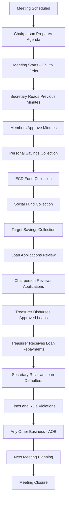

# 🤝 Enhanced Meeting Workflow System

## Overview

The Enhanced Meeting Workflow System provides comprehensive meeting management for savings groups, following the traditional meeting structure you described. This system ensures professional governance, proper documentation, and complete workflow tracking.

## 🏗️ **System Architecture**

### **Core Models**

1. **GroupConstitution** - Group governance rules and regulations
2. **Meeting** - Individual meeting instances with complete tracking
3. **MeetingAgenda** - Structured agenda with workflow steps
4. **MeetingMinutes** - Detailed meeting minutes and documentation
5. **MeetingWorkflowStep** - Individual workflow steps within meetings
6. **LoanApplication** - Formal loan applications with approval workflow
7. **GroupVote** - Voting system for group decisions

### **Meeting Workflow Process**



## 📋 **Meeting Structure Implementation**

### **1. Pre-Meeting Setup**
- **Constitution**: Each group has a formal constitution with governance rules
- **Leadership Roles**: Chairperson, Secretary, Treasurer assigned
- **Agenda Preparation**: Chairperson prepares structured agenda
- **Member Notification**: Members notified of meeting date and agenda

### **2. Meeting Execution Workflow**

#### **Opening (Chairperson)**
- Call meeting to order
- Record attendance
- Verify quorum requirements
- Welcome members and guests

#### **Minutes Review (Secretary)**
- Read previous meeting minutes
- Address any corrections or clarifications
- Get member approval for minutes
- Record approval status

#### **Savings Collection (Treasurer)**
- **Personal Savings**: Individual member contributions
- **ECD Fund**: Early Childhood Development fund contributions
- **Social Fund**: Community social support fund
- **Target Savings**: Specific campaign or goal-based savings
- Record all transactions with member verification

#### **Loan Management (Chairperson & Treasurer)**
- **Application Review**: Chairperson reviews new loan applications
- **Member Discussion**: Group discusses each application
- **Voting**: Members vote on loan approvals
- **Disbursement**: Treasurer disburses approved loans
- **Repayment Collection**: Treasurer collects loan repayments
- **Defaulter Review**: Secretary reads list of loan defaulters

#### **Discipline and Fines (Chairperson)**
- Review rule violations and misconduct
- Impose fines according to constitution
- Record disciplinary actions
- Address member concerns

#### **Any Other Business - AOB (Chairperson)**
- Open floor for member discussions
- Address group concerns and suggestions
- Plan future activities and campaigns
- Make announcements

#### **Closing (Secretary & Chairperson)**
- Schedule next meeting date
- Summarize key decisions and action items
- Close meeting formally
- Record meeting end time

## 🔧 **API Endpoints**

### **Constitution Management**
```
GET    /api/groups/{group_id}/constitution     - Get group constitution
POST   /api/groups/{group_id}/constitution     - Create constitution
PUT    /api/groups/{group_id}/constitution     - Update constitution
```

### **Meeting Management**
```
GET    /api/groups/{group_id}/meetings         - List group meetings
POST   /api/groups/{group_id}/meetings         - Create new meeting
GET    /api/meetings/{meeting_id}              - Get meeting details
POST   /api/meetings/{meeting_id}/start        - Start meeting
POST   /api/meetings/{meeting_id}/complete     - Complete meeting
```

### **Workflow Management**
```
GET    /api/meetings/{meeting_id}/workflow     - Get workflow steps
POST   /api/meetings/{meeting_id}/workflow/{step_id}/complete - Complete step
PUT    /api/meetings/{meeting_id}/agenda       - Update agenda
POST   /api/meetings/{meeting_id}/minutes      - Create/update minutes
```

### **Loan Applications**
```
GET    /api/groups/{group_id}/loan-applications    - List applications
POST   /api/groups/{group_id}/loan-applications    - Submit application
PUT    /api/loan-applications/{app_id}/approve     - Approve application
PUT    /api/loan-applications/{app_id}/reject      - Reject application
```

### **Voting System**
```
GET    /api/groups/{group_id}/votes            - List group votes
POST   /api/groups/{group_id}/votes            - Create new vote
POST   /api/votes/{vote_id}/cast               - Cast vote
GET    /api/votes/{vote_id}/results            - Get vote results
```

## 💼 **Professional Features**

### **Governance Compliance**
- ✅ **Constitutional Framework**: Formal constitution with governance rules
- ✅ **Quorum Requirements**: Automatic quorum calculation and validation
- ✅ **Voting Thresholds**: Configurable voting requirements for decisions
- ✅ **Leadership Terms**: Defined leadership terms and rotation
- ✅ **Fine Structure**: Standardized fine system for rule violations

### **Meeting Documentation**
- ✅ **Structured Agendas**: Professional agenda templates
- ✅ **Detailed Minutes**: Comprehensive meeting minutes with decisions
- ✅ **Action Items**: Tracked action items with assignees
- ✅ **Attendance Records**: Complete attendance tracking
- ✅ **Financial Records**: All financial transactions recorded

### **Workflow Automation**
- ✅ **Step-by-Step Process**: Guided meeting workflow
- ✅ **Time Tracking**: Duration tracking for each workflow step
- ✅ **Responsibility Assignment**: Clear role assignments
- ✅ **Progress Monitoring**: Real-time meeting progress tracking
- ✅ **Completion Validation**: Ensure all steps are completed

### **Decision Making**
- ✅ **Loan Approval Process**: Multi-stage loan approval workflow
- ✅ **Member Voting**: Democratic decision-making system
- ✅ **Consensus Building**: Discussion and voting mechanisms
- ✅ **Appeal Process**: Structured appeal and review process
- ✅ **Transparency**: All decisions recorded and traceable

## 🚀 **Implementation Benefits**

### **For Group Leaders**
- **Professional Management**: World-class meeting management tools
- **Compliance Assurance**: Automatic compliance with governance rules
- **Decision Support**: Data-driven decision making capabilities
- **Time Efficiency**: Streamlined meeting processes
- **Documentation**: Complete meeting documentation and history

### **For Group Members**
- **Transparency**: Full visibility into group decisions and finances
- **Participation**: Easy participation in voting and discussions
- **Accountability**: Clear accountability for all members and leaders
- **Fair Process**: Standardized and fair treatment for all members
- **Professional Experience**: Bank-level professional experience

### **For System Administrators**
- **Scalability**: Handles multiple groups with different governance structures
- **Monitoring**: Complete audit trail and monitoring capabilities
- **Reporting**: Comprehensive reporting on group activities
- **Integration**: Seamless integration with existing savings group features
- **Maintenance**: Easy maintenance and updates

## 📊 **Data Integration**

### **Calendar Integration**
- All meetings automatically appear in group calendar
- Meeting outcomes feed into calendar event details
- Drill-down from calendar events to meeting details
- Historical meeting data available through calendar

### **Financial Integration**
- Meeting savings collections integrate with member savings
- Loan disbursements and repayments tracked in real-time
- Fines automatically added to member accounts
- Financial summaries available in meeting reports

### **Member Integration**
- Attendance records affect member standing
- Leadership roles tracked and rotated
- Member participation in voting recorded
- Performance metrics for loan eligibility

## 🎯 **Success Metrics**

- **Meeting Efficiency**: Average meeting duration and completion rates
- **Member Participation**: Attendance rates and voting participation
- **Decision Quality**: Time to decision and decision reversal rates
- **Compliance**: Constitution adherence and rule violation rates
- **Financial Performance**: Savings collection rates and loan performance

---

## 🚀 **Getting Started**

1. **Initialize System**: Run the meeting workflow initialization script
2. **Create Constitutions**: Set up group constitutions with governance rules
3. **Assign Leadership**: Assign chairperson, secretary, and treasurer roles
4. **Schedule Meetings**: Create and schedule regular group meetings
5. **Train Users**: Train group leaders on the meeting workflow system

The Enhanced Meeting Workflow System transforms traditional savings group meetings into professional, efficient, and well-documented governance processes that rival world-class financial institutions.
